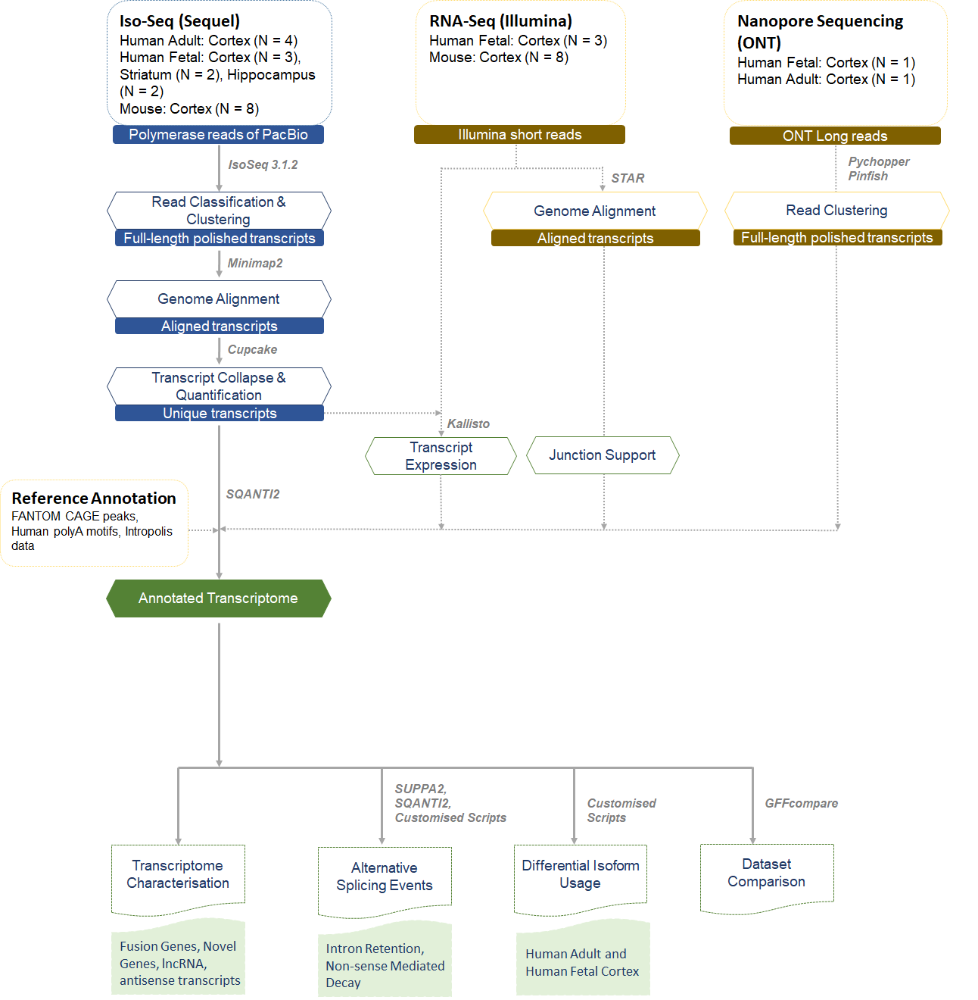
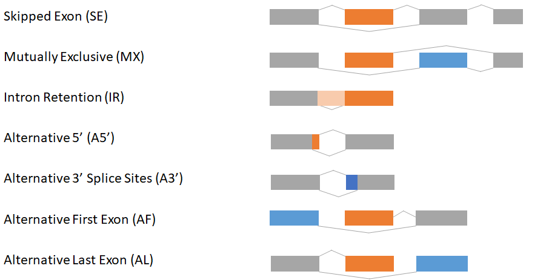

# Iso-Seq of human and mouse cortex 

This is a repository of scripts that were used in the paper **"Full-length transcript sequencing of human and mouse identifies widespread isoform diversity and alternative splicing in the cerebral cortex"** by SK.Leung, A.R.Jeffries,..E.Hannon,J.Mill. 

The scripts are categorised under: 
1. [Processing Iso-Seq data](#processing-iso-seq-data): Iso-Seq3.1.2 Pipeline and Post-Iso-Seq pipeline 
2. [Comparisons with RNA-Seq at gene and isoform level](#comparisons-with-rna-seq)
3. [Novel Genes](#novel-genes)
4. [Characterisation of Alternative splicing events](#alternative-splicing-events)
5. [Differential Transcript Usage](#differential-transcript-usage)
6. [ONT analysis](#ont-analysis) 
7. [Disease](#disease)
8. [Output](#output) - Figures, Tables, Rmarkdowns  
9. [Web Resources](#web_resources )

See Methods on paper for further details.  

---
### Processing Iso-Seq data
+ Run Isoseq3.1.2 pipeline by merging all samples (human cortex, mouse cortex) post-CCS, pre-LIMA. This involves running the working script in [human](https://github.com/SziKayLeung/Whole_Transcriptome_Paper/blob/main/IsoSeq_Processing/Human/All_Demultiplex_Final.sh) and [mouse](https://github.com/SziKayLeung/Whole_Transcriptome_Paper/blob/main/IsoSeq_Processing/Mouse/All_Tg4510_Final.sh), by sourcing the relevant functions script ([human](https://github.com/SziKayLeung/Whole_Transcriptome_Paper/blob/main/IsoSeq_Processing/Human/All_Human_Functions.sh), [mouse](https://github.com/SziKayLeung/Whole_Transcriptome_Paper/blob/main/IsoSeq_Processing/Mouse/All_Tg4510_Functions.sh)). Both functions scripts include steps from *Iso-Seq3 (CCS, LIMA, REFINE, CLUSTER)* to RNA-Seq *STAR* Align for *SQANTI2* input as junctions file and *Kallisto* for *SQANTI2* input as expression file, to *SQANTI2* and filtering. 
    + Note CCS was generated separately for each sample before merging 
+ Subsampling of [human](https://github.com/SziKayLeung/Whole_Transcriptome_Paper/blob/main/IsoSeq_Processing/Human/All_Human_Rarefaction.sh) and [mouse](https://github.com/SziKayLeung/Whole_Transcriptome_Paper/blob/main/IsoSeq_Processing/Mouse/All_Tg4510_Rarefaction.sh) cortex using E.Tseng's scripts for rarefaction curves 
+ Extracting lengths from CCS (circular consensus sequence) reads using [E.Tseng's scripts](https://github.com/Magdoll/cDNA_Cupcake)
+ Summarising the number of CCS reads successfully generated across all Iso-Seq samples 

### Comparisons with RNA-Seq 
+ RNA-Seq data from mouse (n = 12 biologically independent samples) and human fetal (n = 3 biologically independent samples) was aligned to mouse cortical and human fetal cortical Iso-seq transcriptome respectively using *STAR* and *Kallisto* 
+ Determining gene and transcript expression of short-read RNA-Seq from *Kallisto*. 

### Novel Genes 
*Note: Novel genes are defined as transcripts mapped to regions not previously annotated as genes in existing genomic databases (human: hg38, mouse: mm10), and are classified as either "antisense" or "intergenic" by SQANTI2*
+ [Novel Genes Human vs Mouse](https://github.com/SziKayLeung/Whole_Transcriptome_Paper/blob/main/Novel_Genes/Characterising_Novel_Genes.sh): Blast novel genes detected from human cortical Iso-Seq transcriptome to novel genes detected from mouse cortical Iso-Seq transcriptome for homology, with identification of one common novel gene (*TMEM107-VAMP2*)
+ [Novel Genes Across Genome](https://github.com/SziKayLeung/Whole_Transcriptome_Paper/blob/main/Novel_Genes/Characterising_Novel_Genes.sh): Blast novel genes from human cortical Iso-Seq transcriptome to human genome (hg38), and novel genes from mouse cortical Iso-Seq transcriptome to mouse genome (mm10). 
+ [Antisense Novel Genes](https://github.com/SziKayLeung/Whole_Transcriptome_Paper/blob/main/Novel_Genes/Antisense_Novel_Genes.sh): Finding overlap of antisense novel genes with exonic regions of other genes   

### Alternative Splicing Events 

+ Mutually Exclusive (MX) and Skipped Exons (SE) events were identified from SUPPA2
    + Of note, output files from *SUPPA2* only details AS events associated with isoforms, named with PB_IDs, and not the genes.
+ Intron Retention (IR) events were identified from *SQANTI2* (automatially generated and identified from the output classification.txt under column "subcategory")
+ Other AS events (A3', A5', Alternative First (AF), AL (Alternative Last)) were identified from [custom scripts](https://github.com/SziKayLeung/Whole_Transcriptome_Paper/blob/main/Alternative_Splicing/AS_Events.R) using gtf-coordinates 

### Differential Transcript Usage 

### ONT analysis 

### Disease 
+ Assessment of RNA isoform diversity in genes robustly associated with 
    + Alzheimer's disease: APP,PSEN1,PSEN2 and 59 genes nominated from the most recent GWAS meta-analysis
    + Autism: 393 genes nominated as being category 1 (high confidence) and category 2 (strong candidate) from the [SFARI Gene database](https://gene.sfari.org/), from this [list](https://github.com/SziKayLeung/Whole_Transcriptome_Paper/tree/main/Utilities/Disease_Genes/SFARI-Gene_genes_07-29-2020release_08-07-2020export.csv)
    + Schizophrenia: 339 genes nominated from the most recent GWAS meta-analysis, from these two lists: [SZ_CLOZUK_GENE](https://github.com/SziKayLeung/Whole_Transcriptome_Paper/tree/main/Utilities/Disease_Genes/SZ_CLOZUK_GENE.txt) and [SZ_PGC2](https://github.com/SziKayLeung/Whole_Transcriptome_Paper/tree/main/Utilities/Disease_Genes/SZ_PGC2.txt)
+ Number of transcripts, IR-transcripts, fusion transcripts associated with disease were [tabulated](https://github.com/SziKayLeung/Whole_Transcriptome_Paper/tree/main/Disease/Disease.R)

### Output
+ All [figures](https://github.com/SziKayLeung/Whole_Transcriptome_Paper/blob/main/Output/Figures/All_Plots.R) were generated from [script](https://github.com/SziKayLeung/Whole_Transcriptome_Paper/blob/main/Output/Figures/All_Plots_Functions.R)
    + Majority of the figures and tables generated are from *SQANTI2* filtered data (as listed [here](https://github.com/SziKayLeung/Whole_Transcriptome_Paper/blob/main/Output/Input_Variables.R), with [datawrangling](https://github.com/SziKayLeung/Whole_Transcriptome_Paper/blob/main/Output/SQANTI_General.R)
+ [Tables](https://github.com/SziKayLeung/Whole_Transcriptome_Paper/blob/main/Output/Tables/All_Tables.R) include post-analysis with BLAST of novel genes, determining cut-off threshold for high gene expression, finding fusion genes sharing exons with more than 2 genes, and overlap of fusion genes with [ConjoinG](https://metasystems.riken.jp/conjoing/download/)

[Rmarkdowns](https://github.com/SziKayLeung/Whole_Transcriptome_Paper/tree/main/Output/Rmarkdowns) were generated from *SQANTI2* classification files of human cortex (adult, fetal) and mouse cortex (4 Iso-Seq datasets) for summary information:   
+ Descriptive summary: Detailing all the descriptive numbers and lengths of genes and transcripts in each Iso-Seq dataset
    + Summary is provided for both *SQANTI2* filtered and unfiltered data 
+ Human and Mouse Comparison: Tabulate the number of isoforms per gene across human and mouse cortex, and human adult and human fetal cortex 
    + Homology is accounted by converting mouse genes to the equivalent human genes using [mouse genome informatics syntenic gene list](http://www.informatics.jax.org/downloads/reports/HOM_MouseHumanSequence.rpt)
+ Fusion genes: Number of fusion genes in each Iso-Seq dataset, and common genes, and those associated with disease
+ Intron retention: Number of genes and transcripts with intron retention in each Iso-Seq dataset with comparisons across genes, and those associated with disease
+ Novel Genes: Number of Novel genes, and proportion with RNA-Seq support, within 50bp of a CAGE peak, and associated with disease 
